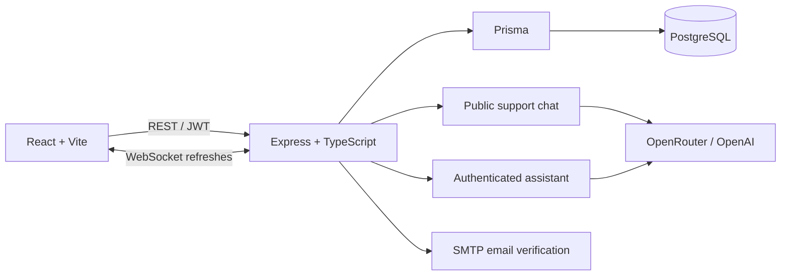

# TunaBank

TunaBank is a full-stack banking learning project with a React dashboard, an Express/PostgreSQL API, real-time balance updates, and one floating Tuna chat experience.

The chat intentionally has two modes:

- **TunaBank support** is available while signed out. It answers general app and banking questions and never receives account data.
- **Tuna · Your banking assistant** is available on authenticated dashboard and transfer pages. It can read the signed-in customer’s current balance and transfer records, summarize activity, and prepare—but never submit—a transfer draft.

> This is a learning project, not a real financial service. Do not use real credentials, money, or sensitive financial information.

## Live links

- App: [tunabank.onrender.com](https://tunabank.onrender.com)
- API and Swagger UI: [tuna-bank-be.onrender.com/api-docs](https://tuna-bank-be.onrender.com/api-docs)

## What you can do

- Register, verify an email address, sign in, and sign out
- View a balance and transfer history
- Send money to another verified TunaBank user through the normal transfer form
- Receive dashboard refresh notifications through WebSockets
- Ask public support questions without signing in
- Ask the authenticated assistant for a fresh balance, recent transactions, a transaction summary, or help preparing a transfer

The assistant’s **Review transfer** action only opens the existing form with a validated recipient and amount. The customer must review the values, check the confirmation box, and submit through the normal authenticated endpoint before money can move.

## Architecture



## Assistant safety model

- Every private assistant request requires a valid, non-revoked JWT. The account comes from that token, never from chat text or browser state.
- Account tools are read-only, validated, and scoped to the authenticated user. The model cannot choose an account, run SQL, call arbitrary URLs, or execute a transfer.
- Balances and transaction facts come from fresh database reads; stored chat history is untrusted context only.
- Public and private conversations are separate browser-session histories. Logging out or switching accounts clears the private history and pending draft.
- Both chat routes share in-memory IP/user/request/model-call limits. Limits reset when the single backend process restarts.
- Browser-supplied time zones are used only to present authorized transaction timestamps; UTC is used as a safe fallback.

OpenRouter receives only the minimal information needed for a response. Review the selected provider’s data handling before using real account data.

## Quick start

Requirements: Node.js, npm, and PostgreSQL.

```bash
git clone https://github.com/nofechbo/bank.git
cd bank
```

1. Configure and start the API:

   ```bash
   cd bank_be
   cp .env.example .env
   # Set DATABASE_URL, JWT_SECRET, mail settings, and allowed frontend origin.
   npm install
   npx prisma migrate dev
   npm run dev
   ```

2. In another terminal, configure and start the frontend:

   ```bash
   cd bank_fe
   cp .env.example .env
   # Set VITE_BACKEND_URL=http://localhost:3030
   npm install
   npm run dev
   ```

Open `http://localhost:5173`. Swagger is available at `http://localhost:3030/api-docs`.

To enable AI chat, set a server-only `OPENROUTER_API_KEY`; public support can alternatively use `OPENAI_API_KEY`. Never put provider keys in frontend environment variables.

## Repository guide

| Directory | Purpose |
| --- | --- |
| [`bank_fe`](./bank_fe) | React, TypeScript, Vite, and Material UI application |
| [`bank_be`](./bank_be) | Express API, Prisma schema, assistant workflow, tests, and Swagger |
| [`ai-banking-assistant-plan.txt`](./ai-banking-assistant-plan.txt) | Implementation and security decisions for the assistant |

See the [backend README](./bank_be/README.md) for API, environment, and test details, and the [frontend README](./bank_fe/README.md) for UI-specific setup.

## Verification

```bash
cd bank_be && npm test
cd ../bank_fe && npm test && npm run build
```

The automated tests cover authentication, revoked tokens, account ownership, bounded assistant tools, untrusted-history resistance, quota behavior, transfer-draft safety, and browser chat lifecycle behavior.

## Docker

`docker-compose.yml` provides frontend, backend, and PostgreSQL services. Copy the environment examples first and ensure the backend `PORT` matches the Compose port mapping before starting:

```bash
docker compose up --build
```

## Author

Built by Nofech Ben-Or.
